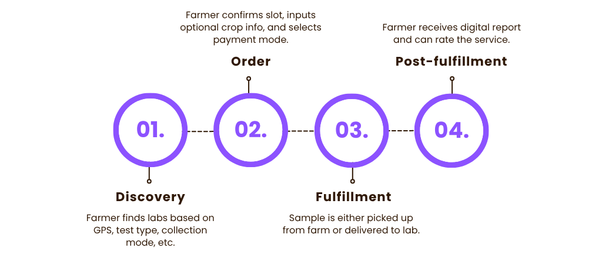

# Beckn-Enabled Agri Integration: Soil Testing

The Beckn Protocol defines a decentralized framework for digital commerce by enabling interoperability between buyer-facing (BAP) and seller-facing (BPP) platforms.
UKI (Unified Krishi Interface) applies this protocol to agriculture by building an open, farmer-centric network where services such as soil testing, input delivery, crop advisory, and equipment rentals are made accessible through interoperable digital interfaces.

In the context of *soil testing*, UKI enables farmers to discover service providers, schedule sample collection, receive detailed reports, and give feedback—all via Beckn-compliant apps and APIs without relying on centralized marketplaces.

<h3>Table of Contents</h3>

  
<a href="#objective">&emsp;Objective</a>

  <ul>
  </ul>

  
<a href="#overview-of-the-soil-testing-use-case">&emsp;Overview of the Soil Testing Use Case</a>

  <ul>
  </ul>

  
<a href="#understanding-beckn-roles">&emsp;Understanding Beckn Roles</a>

- [3.1 BAP (Beckn App Platform)](#31-bap--beckn-app-platform)

- [3.2 BPP (Beckn Provider Platform)](#32-bpp--beckn-provider-platform)

- [3.3 Entities Involved](#33-entities-involved)

- [3.4 Role Mapping in UKI](#34-role-mapping-in-uki)

  
<a href="#service-flow-breakdown">&emsp;Service Flow Breakdown</a>

- [4.1 Discovery Phase](#41-discovery-phase)

- [4.2 Order Phase](#42-order-phase)

- [4.3 Fulfillment Phase](#43-fulfillment-phase)

- [4.4 Post-Fulfillment Phase](#44-post-fulfillment-phase)

  
<a href="./api-reference.md">&emsp;API Call Sequence</a>

- [5.1 High-Level API Flow](#51-high-level-api-flow)

- [5.2 Supported API Calls](#52-supported-api-calls)

- [5.3 Callback Considerations](#53-callback-considerations)

- [5.4 Error Handling Patterns](#54-error-handling-patterns)

- [5.6 Developer Notes](#56-developer-notes)

  

    <a href="#challenges--assumptions">&emsp;Challenges & Assumptions</a>
  

  <ul>
  </ul>

## Objective

This guide serves as a practical implementation manual for network participants, specifically BAPs (Beckn App Platforms) and BPPs (Beckn Provider Platforms) to integrate with the [UKI (Unified Krishi Interface)](https://uki.becknprotocol.io/) for an agricultural use case: **Soil Testing Services**

It outlines the interaction patterns, message flows, domain models, and API specifications defined by the [Beckn Protocol](https://github.com/beckn/protocol-specifications), applied in the context of farmer-centric agricultural services.

References:

* [Beckn Protocol Specifications](https://github.com/beckn/protocol-specifications)
* [UKI Official Site](https://uki.becknprotocol.io/)
* [API Reference Docs](https://developers.becknprotocol.io/docs/mobility-specification/api-reference/)

## Overview of the Soil Testing Use Case

This section outlines how soil testing services are delivered over the UKI network using the Beckn Protocol.

- **Context:** Farmers use Beckn-enabled apps (BAPs) to access soil testing labs (BPPs) through a decentralized open network.

- **Objective:** Digitize soil testing workflows - discovery, order, fulfillment, and reporting using interoperable APIs.

- **Journey Summary:**
    > Discovery → Order → Fulfillment → Post-fulfillment

    - *Discovery:* Farmer finds labs based on GPS, test type, collection mode, etc.

    - *Order:* Farmer confirms slot, inputs optional crop info, and selects payment mode.

    - *Fulfillment:* Sample is either picked up from farm or delivered to lab.

    - *Post-fulfillment:* Farmer receives digital report and can rate the service.

## Understanding Beckn Roles

### 3.1 BAP – Beckn App Platform

The **BAP** is the client-facing application through which end users—typically farmers—can discover, evaluate, and request services from providers on the UKI network.

* It exposes a searchable interface for soil testing services.
* It manages selection, order lifecycle (`init`, `confirm`), and post-fulfillment actions such as feedback (`rating`).

* It conforms to Beckn Protocol standards by emitting and consuming standard event-based API calls.

> **Example:** A mobile or web-based app that allows a farmer to book soil testing and view reports.

### 3.2 BPP – Beckn Provider Platform

The **BPP** is the service-side interface used by entities offering soil testing services. It enables these providers to publish their offerings, respond to discovery queries, and handle fulfillment updates.

* It responds to BAP requests such as `on_search`, `on_select`, and `on_confirm`.

* It shares details such as time slots, service quotes, sample collection instructions, and test reports.
* It may optionally support logistics, such as farm pickup of soil samples.

> **Example:** A backend system operated by a local soil testing center that interfaces with the network via Beckn-compliant APIs.

### 3.3 Entities Involved

| Entity                | Role Type         | Description                                                |
| --------------------- | ----------------- | ---------------------------------------------------------- |
| Farmer                | BAP User          | Requests soil testing using a Beckn-enabled application.   |
| Soil Testing Provider | BPP Provider      | Offers services like NPK testing, pH analysis, etc.        |
| Extension Agent       | Fulfillment Agent | Optional; carries out sample collection at farm locations. |
| Aggregator  | BPP Gateway       | Optional; Routes requests across multiple service providers.         |
| Developer/Integrator  | System Integrator | Builds and maintains compliant BAP or BPP integrations.    |

### 3.4 Role Mapping in UKI

In the context of the UKI agricultural network:

| Beckn Role  | UKI Mapping Example                                                                   |
| ----------- | ------------------------------------------------------------------------------------- |
| BAP         | Any farmer-facing application enabling discovery and booking of soil testing services |
| BPP         | Backend interface of a service provider offering soil diagnostics                     |
| Fulfillment | On-site agent or system that executes soil collection or test delivery                |
| Buyer       | Farmer requesting the service                                                         |
| Seller      | Soil testing service provider                                                         |

These roles communicate through a registered Beckn Gateway, ensuring interoperability and discoverability across the open network.

## Service Flow Breakdown

### 4.1 Discovery Phase

The discovery phase begins when the user searches for nearby soil testing centres using a Beckn-compliant BAP (Beckn App Platform).

  
<b>Filters available during search:</b>

* Rating of the service provider

* Provider’s experience

* Location of farm or collection centre

* Cost of services

* Date and time availability

* Collection type:

  * Provider pickup from farm

  * User delivers sample to centre

* Required test types:

  * **Soil Tests**: NPK, Ca/Mg/S, EC, pH, OC, Zn/B/Cu/Fe/Mo/Mn, Texture, Moisture, Contaminants, CEC

  * **Water Test**

  * **Chemical Test**

  
<b>Provider response includes:</b>

* List of service offerings
* Available time slots
* Quote based on test and collection type
* Pre-requisites for soil collection (e.g. video, image, PDF)

* Terms and conditions (cancellation/refund policies)

  
<b>Optional details requested by provider:</b>

* Crop Category (Agriculture/Forest)

* Crop Type, Crop Name, Variety
* Previous yield data

### 4.2 Order Phase

In this phase, the user reviews the selected service details and proceeds with booking confirmation.

  
<b>Order flow includes:</b>

* Acceptance of terms, quote, and available slot

* Selection of payment method (e.g., Cash on Delivery)

* Order confirmation via BAP

  
<b>Provider response includes:</b>

* Booking confirmation

* Assigned agent details (if applicable)

* Generated Order ID

### 4.3 Fulfillment Phase

The fulfillment phase covers the actual collection of the soil sample and the completion of the testing process. This varies depending on the chosen collection method:

  
<b>If collection is at the farm:</b>

* User receives status updates from the provider on the scheduled day

* The provider’s agent visits the farm, collects the soil sample, and completes the activity

* Payment is made in cash at the time of service

  
<b>If the sample is delivered to the centre:</b>

* The user prepares the sample according to the provided instructions

* The sample is delivered directly to the soil testing centre

* Payment is made. 

  
<b>After collection:</b>

* The user receives updates on testing progress

* A detailed soil report is delivered, typically in PDF format

* Recommended interventions (videos, PDFs, or images) are included to address identified deficiencies

### 4.4 Post-Fulfillment Phase

After the service is completed, the user is given the opportunity to provide feedback and request support if needed.

  
<b>Post-service feedback includes:</b>

* Rating of the service quality

* Rating of provider behavior (e.g. punctuality, professionalism)

* Additional feedback requested by the provider

  
<b>Support interactions (if applicable):</b>

* Users may contact support channels for any delivery issues or quality concerns

> 📌 For detailed request/response schemas, see [API Reference →](./api-reference.md)

## Challenges & Assumptions

* The soil sample collection process is assumed to be manually scheduled post-confirmation, outside the automated Beckn flow.

* Soil testing providers may operate in rural areas with intermittent internet connectivity; response timeouts must be gracefully handled by BAPs.

* Fulfillment windows are approximate and not guaranteed unless the provider explicitly supports slot-based scheduling.

* Report delivery is expected in digital (PDF) format, typically shared via a download link through the `status` or `update` callback.

* Service availability and pricing are assumed to vary by location and provider, so BAPs should always wait for a fresh `on_search` result before constructing offers.

* Payment modes (prepaid or postpaid) vary across BPPs; offline collection is considered a valid mode in many regions.

* The farmer’s language preference is not directly supported in the current schema; localization is expected to be handled by BAP interfaces.

---
<h3 align="center">Based on Beckn Protocol</h3>

Prepared by Muhammed Zafar MM · June 2025
